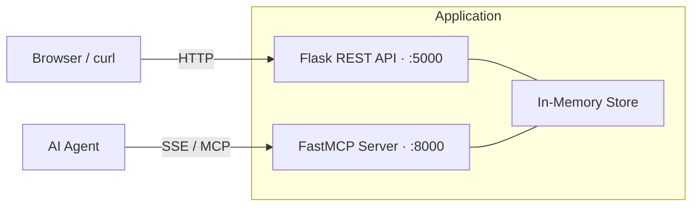
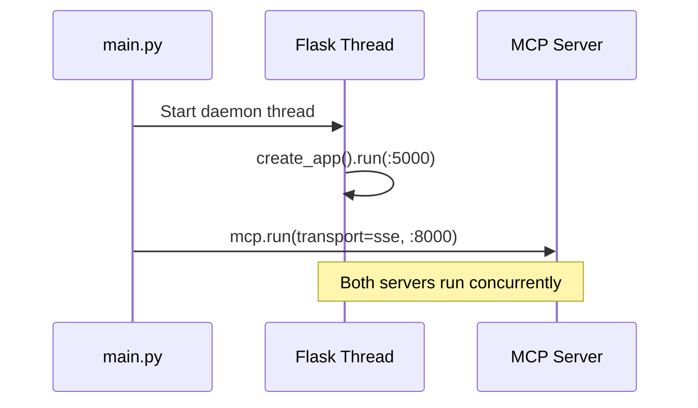

# AGENTS.md — Project Instructions for AI Agents

> **What is this file?**
> This is the single source of truth that tells any AI coding agent
> _how to work with this project_. Think of it as onboarding documentation —
> but written for an AI pair-programmer instead of a human.

---

## Project Overview

**test-ai-docs** is a Flask REST API paired with a FastMCP (Model Context Protocol) server.
Both run from a single entry point and serve as an internal boilerplate
for CiscoIT teams starting new Python microservices.

| Component       | Tech           | Port  | Purpose                        |
|-----------------|----------------|-------|--------------------------------|
| REST API        | Flask 3.x      | 5000  | Standard HTTP endpoints        |
| MCP Server      | FastMCP 2.x    | 8000  | AI-agent tool interface (SSE)  |
| Package Manager | uv             | —     | Fast dependency management     |
| Tests           | pytest          | —     | Unit + integration tests       |

---

## Architecture



### How the servers start together



---

## Project Layout

```
.
├── AGENTS.md                ← You are here. Agent instructions.
├── app.py                   ← Flask application factory + routes
├── mcp_server.py            ← FastMCP server (tools, resources, prompts)
├── main.py                  ← Combined entry point — runs both servers
├── pyproject.toml           ← Dependencies and project metadata
├── .cursor/
│   └── skills/
│       └── runbook/
│           └── SKILL.md     ← Operations skill (deploy, health, incidents)
├── docs/
│   ├── architecture.md      ← System design details (reference doc)
│   └── onboarding.md        ← New team member guide (reference doc)
└── tests/
    ├── test_flask.py        ← Flask endpoint tests
    └── test_mcp.py          ← MCP tool unit tests
```

---

## Coding Conventions

| Rule                             | Detail                                            |
|----------------------------------|---------------------------------------------------|
| Python version                   | 3.12+ (see `.python-version`)                     |
| Imports                          | Use `from __future__ import annotations`          |
| Type hints                       | Required on all function signatures                |
| App factory                      | Flask uses `create_app()` pattern                  |
| Package manager                  | `uv` only — never `pip install` directly           |
| Test runner                      | `uv run pytest -v`                                 |
| Formatting                       | Follow existing code style in the file you edit    |

---

## Common Tasks

### Run the full stack

```bash
uv run python main.py
```

### Run tests

```bash
uv run pytest -v
```

### Add a new Flask endpoint

1. Open `app.py`
2. Add a new route inside `create_app()`
3. Add a test in `tests/test_flask.py`
4. Run `uv run pytest -v` to verify

### Add a new MCP tool

1. Open `mcp_server.py`
2. Add a function decorated with `@mcp.tool()`
3. Add a test in `tests/test_mcp.py`
4. Update the `server_info()` tool's tools list

---

## Skills & Skill Documents

### Agent Skills (.cursor/skills/)

Project-level Cursor skills live in `.cursor/skills/`. These are automatically
discovered by the agent and triggered by matching task context.

| Skill | Path | When it activates |
|-------|------|-------------------|
| **runbook** | `.cursor/skills/runbook/SKILL.md` | Starting the service, deploying, health checks, smoke tests, incident response, rollback, debugging connection errors |

### Reference Documents (docs/)

The `docs/` folder contains detailed guides that serve as additional
agent context — when an AI agent needs deeper knowledge beyond this file
or the skills above, it reads the relevant doc.

| Document              | When to use it                                     |
|-----------------------|----------------------------------------------------|
| `docs/architecture.md`| Understanding system design or making design choices|
| `docs/onboarding.md`  | Setting up a dev environment for the first time     |

> **Why this matters:** Instead of stuffing every detail into one massive file,
> the agent pulls in only the knowledge it needs — just like a human
> would open the right wiki page for the task at hand.

---

## What NOT to Do

- Do not commit `.env` files or hardcoded secrets
- Do not use `pip` — use `uv sync` and `uv run`
- Do not modify test seed data without updating assertions
- Do not expose Flask debug mode in production (`debug=False`)
