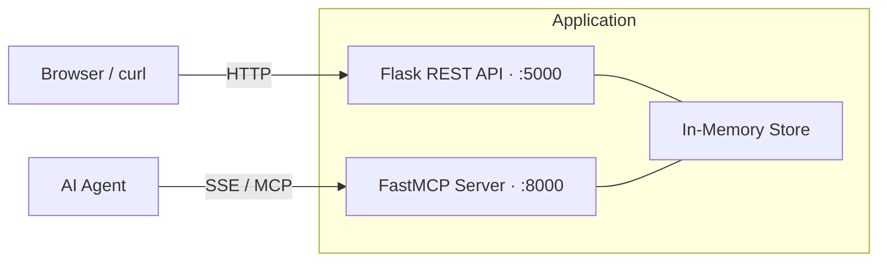
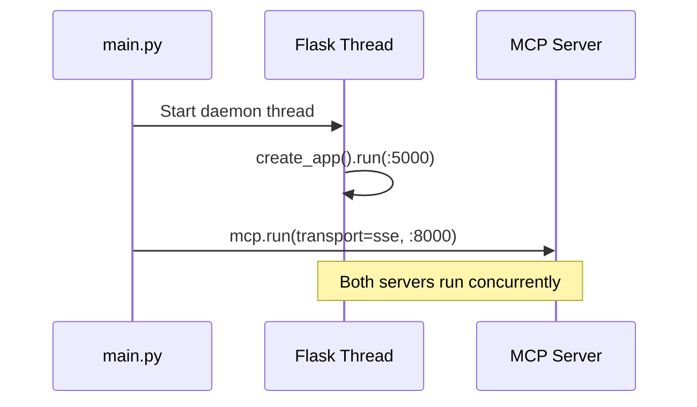

# Flask+FastMCP Project — Project Instructions for AI Agents

## Project Overview

**ai_demo** is a Flask REST API paired with a FastMCP (Model Context Protocol) server.
Both run from a single entry point and serve as an internal boilerplate
for CiscoIT teams starting new Python microservices.

| Component       | Tech           | Port  | Purpose                        |
|-----------------|----------------|-------|--------------------------------|
| REST API        | Flask 3.x      | 5000  | Standard HTTP endpoints        |
| MCP Server      | FastMCP 2.x    | 8000  | AI-agent tool interface (SSE)  |
| Package Manager | uv             | —     | Fast dependency management     |
| Tests           | pytest          | —     | Unit + integration tests       |

---

## Architecture



### How the servers start together



---

## Coding Standards

### Language & Runtime

- Python 3.12+ (enforced via `.python-version`)
- Use `uv` exclusively — never `pip install` directly
- Add dependencies with `uv add <pkg>`; restore with `uv sync`

### Style & Structure

- Every module begins with `from __future__ import annotations`
- All function signatures require type hints on every param and the return type
- `snake_case` for functions and variables; `PascalCase` for classes
- Match the style of the file you're editing — no wholesale reformats
- Keep lines ≤ 100 characters
- All Flask routes must live inside `create_app()` — no module-level route definitions
- Every `@mcp.tool()` function must have a one-line docstring

### What NOT to Write

- No hardcoded secrets, tokens, or credentials — use environment variables
- No `print()` statements in production code — use `logging`
- No bare `except:` clauses — always catch specific exception types
- No mutable default arguments (e.g. `def f(items=[])`)
- No `debug=True` outside of local dev; never in `main.py`

---

## Testing Guidelines

### Structure

```
tests/
├── test_flask.py   ← Route-level tests (status codes, response bodies)
└── test_mcp.py     ← MCP tool unit tests (call tools directly)
```

### Running Tests

```bash
# Run full suite
uv run pytest -v

# Run a single file
uv run pytest tests/test_flask.py -v

# Run a single test by name
uv run pytest -v -k "test_health"
```

### Requirements

- Every new Flask route needs at least one happy-path test
- Every new `@mcp.tool()` needs a test in `test_mcp.py`
- Test at least one 4xx/5xx response per route
- Do not modify fixture data shared across tests
- Each test must create its own `app` via `create_app()` — no shared state between tests
- `uv run pytest -v` must exit 0 before any commit

### Flask Test Pattern

```python
import pytest
from app import create_app

@pytest.fixture()
def client():
    app = create_app()
    app.config["TESTING"] = True
    return app.test_client()

def test_health(client):
    resp = client.get("/health")
    assert resp.status_code == 200
    assert resp.get_json()["status"] == "healthy"
```

### MCP Tool Test Pattern

```python
from mcp_server import add, hello

def test_add():
    assert add(2, 3) == 5.0

def test_hello_default():
    assert "World" in hello()
```

---

## Security Guidelines

### SonarQube Extension

This project uses the **SonarQube for IDE** VS Code extension for continuous static
analysis. The extension surfaces issues inline in the editor and via the Problems panel.

#### Severity Levels

| Level      | Action Required                                             |
|------------|-------------------------------------------------------------|
| 🔴 Blocker  | Fix immediately — do not merge                              |
| 🔴 Critical | Fix before opening a PR                                     |
| 🟠 Major    | Fix in the same PR where the code was introduced            |
| 🟡 Minor    | Fix if touched in the same file; OK to defer otherwise      |
| 🔵 Info     | Optional; address when convenient                           |

#### How to Use the Extension

1. Open the **Problems** panel (`Cmd+Shift+M`) — SonarQube issues appear alongside compiler errors.
2. Click any issue to jump to the affected line.
3. Right-click the issue → **Show SonarQube Rule** to read the full explanation and compliant code examples.
4. Fix the code, then save — the extension re-analyzes automatically.

#### Running a Full Project Analysis (MCP tools)

```
# Via Copilot agent — triggers SonarQube MCP tools
"Analyze all files for security issues"
"Show me all sonar issues in the project"
"What is the quality gate status?"
```

The agent will call `mcp_sonarqube_analyze_file_list`, `mcp_sonarqube_search_sonar_issues_in_projects`,
and `mcp_sonarqube_get_project_quality_gate_status` automatically.

#### Common Issue Categories to Watch

- **Injection (OWASP A03)** — unsanitized `request` data passed to shell, SQL, or `eval` calls
- **Hardcoded credentials** — API keys or passwords committed in source files
- **Insecure deserialization** — unpickling untrusted data
- **Missing input validation** — accepting arbitrary JSON fields without a schema check
- **Debug mode in production** — `debug=True` or `app.run()` called outside a local dev context
- **Broad exception handling** — `except Exception` that swallows errors silently
- **Security hotspots** — run `mcp_sonarqube_search_security_hotspots` to surface these

#### Fix Workflow

1. Run analysis or open a flagged file.
2. Read the SonarQube rule explanation (right-click → Show Rule).
3. Apply the suggested fix — prefer the **compliant code example** from the rule.
4. Re-run `uv run pytest -v` to confirm nothing broke.
5. Re-analyze to confirm the issue is resolved before committing.

#### Suppressing a False Positive

Only suppress after confirming it is genuinely a false positive. Add an inline comment
explaining why, and note the Sonar rule ID:

```python
result = eval(expr)  # noqa: S307  — expr is validated against an allowlist above
```

Never suppress Blocker or Critical issues without a team review.

---

## Common Tasks

### Run the full stack

```bash
uv run python main.py
```

### Run tests

```bash
uv run pytest -v
```

### Add a new Flask endpoint

1. Open `app.py`
2. Add a new route inside `create_app()`
3. Add a test in `tests/test_flask.py`
4. Run `uv run pytest -v` to verify

### Add a new MCP tool

1. Open `mcp_server.py`
2. Add a function decorated with `@mcp.tool()`
3. Add a test in `tests/test_mcp.py`
4. Update the `server_info()` tool's tools list

---

## Skills & Skill Documents

### Agent Skills (.cursor/skills/)

Project-level skills live in `.cursor/skills/` and are auto-discovered by the agent.

- **runbook** (`.cursor/skills/runbook/SKILL.md`) — activates for: starting the service, deploying, health checks, smoke tests, incident response, rollback, debugging connection errors

### Reference Documents (docs/)

Pull these in when you need deeper context beyond this file.

- `docs/architecture.md` — system design details; read before making architectural decisions
- `docs/onboarding.md` — dev environment setup; read when bootstrapping for the first time

---

## Quick-Reference: What NOT to Do

- Don't commit `.env` files or hardcoded secrets — use environment variables
- Don't use `pip install` — use `uv add <pkg>` or `uv sync`
- Don't modify shared test seed data — create isolated fixtures per test
- Don't set `debug=True` in `main.py` or any production path — use an env var to toggle
- Don't add a route without a test — write it first or immediately after
- Don't ignore Blocker/Critical SonarQube issues — fix before opening a PR
- Don't use bare `except:` or swallow exceptions — catch specific types and log
- Don't reformat files you didn't functionally change — match existing style
