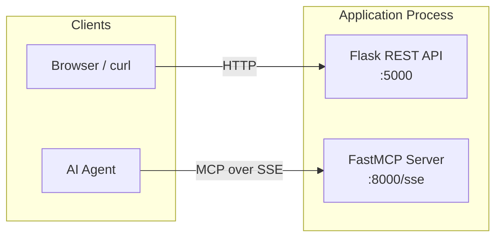
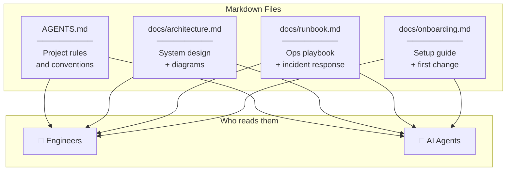

# Flask + FastMCP Boilerplate

A minimal boilerplate combining a **Flask** REST API with a **FastMCP** server,
managed via **uv**. Built as a starting point for CiscoIT teams
adopting AI-assisted development workflows.

---

## Architecture at a Glance



| Component  | File             | Port | Purpose                       |
|------------|------------------|------|-------------------------------|
| REST API   | `app.py`         | 5000 | HTTP endpoints for users/apps |
| MCP Server | `mcp_server.py`  | 8000 | AI-agent tool interface       |
| Entry point| `main.py`        | —    | Runs both servers together    |

---

## Quick Start

```bash
# Install dependencies
uv sync --group dev

# Run both servers
uv run python main.py

# Run tests
uv run pytest -v
```

---

## Project Layout

```
.
├── AGENTS.md             # AI agent instructions (start here for AI context)
├── README.md             # This file — human-first project overview
├── app.py                # Flask application factory + routes
├── mcp_server.py         # FastMCP server (tools, resources, prompts)
├── main.py               # Combined entry point
├── pyproject.toml         # Dependencies and metadata
├── docs/
│   ├── architecture.md   # System design deep-dive
│   ├── runbook.md        # Operations playbook
│   └── onboarding.md     # New team member setup guide
└── tests/
    ├── test_flask.py     # Flask endpoint tests
    └── test_mcp.py       # MCP tool unit tests
```

---

## How AI Docs Work in This Repo

This project demonstrates a pattern where **markdown documentation
doubles as AI agent knowledge**. Here's what that means:



### The four concepts demonstrated

| Concept                  | Where to see it           | What it means                                            |
|--------------------------|---------------------------|----------------------------------------------------------|
| **Markdown as language** | Every `.md` file          | Plain markdown is readable by humans AND parsed by agents|
| **AGENTS.md**            | `AGENTS.md` (repo root)   | A single file that tells agents how to work here         |
| **Mermaid charts**       | Throughout all docs        | Visual diagrams embedded in markdown — no extra tools    |
| **Docs as skills**       | `docs/` folder             | Each doc is a "skill" agents can pull in when needed     |

### Why this matters for your team

- **You already write docs.** Now those same docs also make your AI tools smarter.
- **No new tooling.** It's just markdown files in your repo — version-controlled, reviewable, mergeable.
- **Knowledge doesn't leave.** When an SME writes a runbook, that expertise lives in the repo forever — for humans and AI alike.

---

## Flask Endpoints

| Method | Path           | Description                        |
|--------|----------------|------------------------------------|
| GET    | `/`            | Service info and endpoint list     |
| GET    | `/health`      | Health check                       |
| GET    | `/hello/<name>`| Personalized greeting              |
| GET    | `/items`       | List all items                     |
| POST   | `/items`       | Create item `{"name":"…","value":0}` |

## MCP Tools / Resources / Prompts

| Type     | Name               | Description               |
|----------|--------------------|---------------------------|
| Tool     | `hello(name)`      | Greet someone by name     |
| Tool     | `add(a, b)`        | Add two numbers           |
| Tool     | `server_info()`    | Server metadata           |
| Resource | `greeting://{name}`| Greeting resource         |
| Prompt   | `hello_prompt(name)`| Greeting prompt template |

---

## Further Reading

| Document                                                | What's inside                                |
|---------------------------------------------------------|----------------------------------------------|
| **[AGENTS.md](AGENTS.md)**                              | AI agent instructions for this project       |
| **[docs/architecture.md](docs/architecture.md)**        | System design and component diagrams         |
| **[docs/runbook.md](docs/runbook.md)**                  | Operations, deployment, incident response    |
| **[docs/onboarding.md](docs/onboarding.md)**            | New team member setup guide                  |
| **[assets/mermaid_demo.md](assets/mermaid_demo.md)**    | Mermaid diagram type reference (22 examples) |
