# Mermaid Diagram Showcase

A visual guide to every diagram type supported by Mermaid.

---

## 1. Flowchart

Model decision logic, processes, and branching workflows.

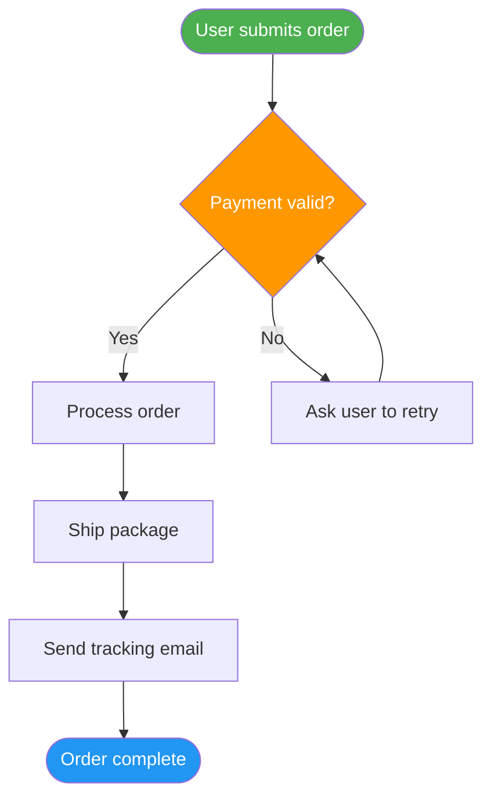
```mermaid
flowchart TD
    Start([User submits order]) --> Validate{Payment valid?}
    Validate -->|Yes| Process[Process order]
    Validate -->|No| Retry[Ask user to retry]
    Retry --> Validate
    Process --> Ship[Ship package]
    Ship --> Notify[Send tracking email]
    Notify --> Done([Order complete])

    style Start fill:#4CAF50,color:#fff
    style Done fill:#2196F3,color:#fff
    style Validate fill:#FF9800,color:#fff
```

---

## 2. Flowchart (Left to Right)

Same concept, horizontal layout — great for pipelines.

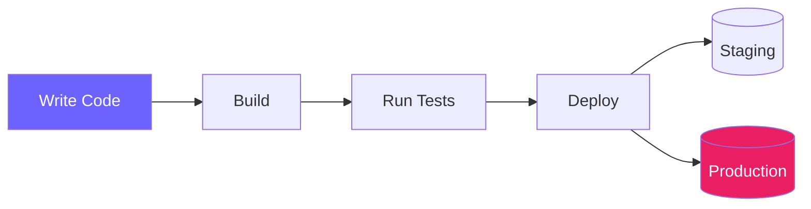
```mermaid
flowchart LR
    Code[Write Code] --> Build[Build] --> Test[Run Tests] --> Deploy[Deploy]
    Deploy --> Staging[(Staging)]
    Deploy --> Prod[(Production)]

    style Code fill:#6C63FF,color:#fff
    style Prod fill:#E91E63,color:#fff
```

---

## 3. Sequence Diagram

Show how components talk to each other over time.

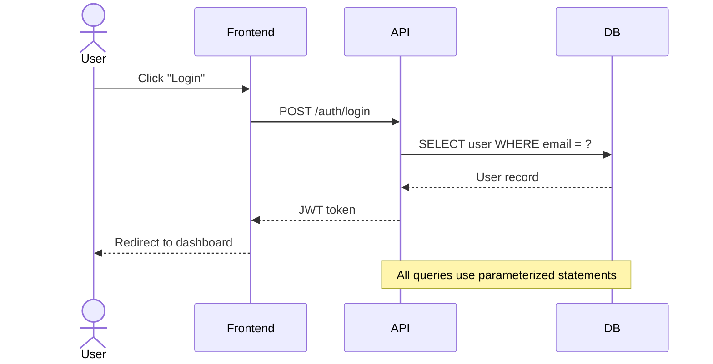
```mermaid
sequenceDiagram
    actor User
    participant Frontend
    participant API
    participant DB

    User->>Frontend: Click "Login"
    Frontend->>API: POST /auth/login
    API->>DB: SELECT user WHERE email = ?
    DB-->>API: User record
    API-->>Frontend: JWT token
    Frontend-->>User: Redirect to dashboard

    Note over API,DB: All queries use parameterized statements
```

---

## 4. Class Diagram

Visualize object-oriented structures and relationships.

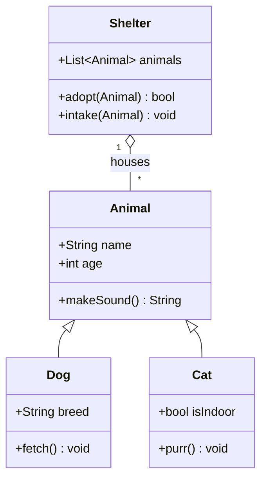
```mermaid
classDiagram
    class Animal {
        +String name
        +int age
        +makeSound() String
    }
    class Dog {
        +String breed
        +fetch() void
    }
    class Cat {
        +bool isIndoor
        +purr() void
    }
    class Shelter {
        +List~Animal~ animals
        +adopt(Animal) bool
        +intake(Animal) void
    }

    Animal <|-- Dog
    Animal <|-- Cat
    Shelter "1" o-- "*" Animal : houses
```

---

## 5. State Diagram

Represent the lifecycle states of an entity.

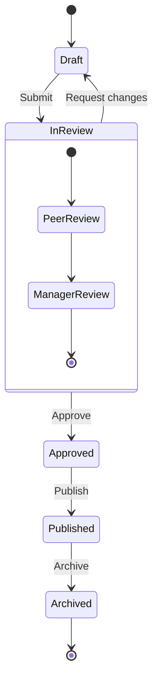
```mermaid
stateDiagram-v2
    [*] --> Draft
    Draft --> InReview : Submit
    InReview --> Approved : Approve
    InReview --> Draft : Request changes
    Approved --> Published : Publish
    Published --> Archived : Archive
    Archived --> [*]

    state InReview {
        [*] --> PeerReview
        PeerReview --> ManagerReview
        ManagerReview --> [*]
    }
```

---

## 6. Entity Relationship Diagram

Define database schemas and table relationships.

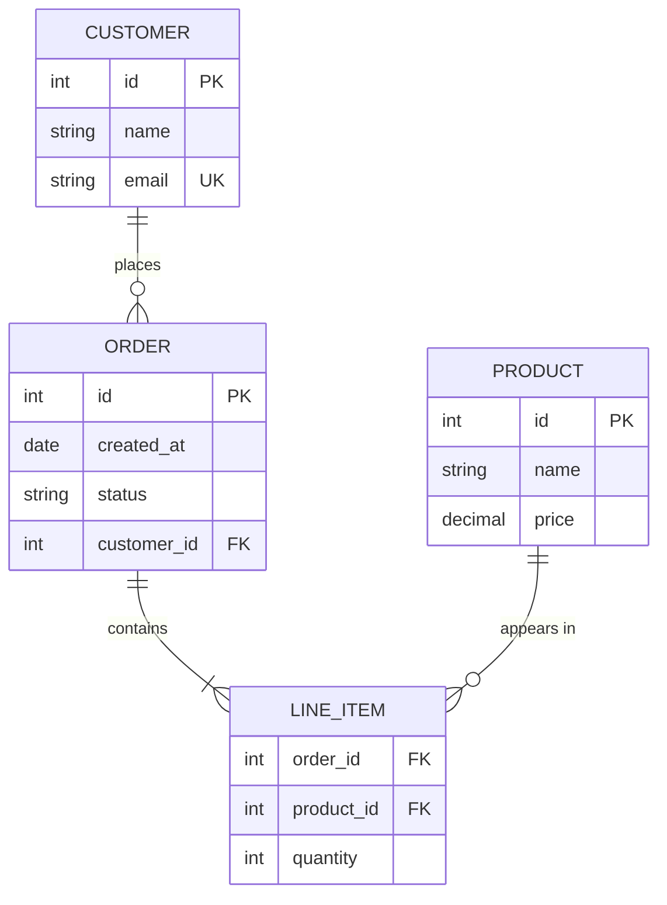
```mermaid
erDiagram
    CUSTOMER ||--o{ ORDER : places
    ORDER ||--|{ LINE_ITEM : contains
    PRODUCT ||--o{ LINE_ITEM : "appears in"
    CUSTOMER {
        int id PK
        string name
        string email UK
    }
    ORDER {
        int id PK
        date created_at
        string status
        int customer_id FK
    }
    PRODUCT {
        int id PK
        string name
        decimal price
    }
    LINE_ITEM {
        int order_id FK
        int product_id FK
        int quantity
    }
```

---

## 7. Gantt Chart

Plan project timelines and task dependencies.

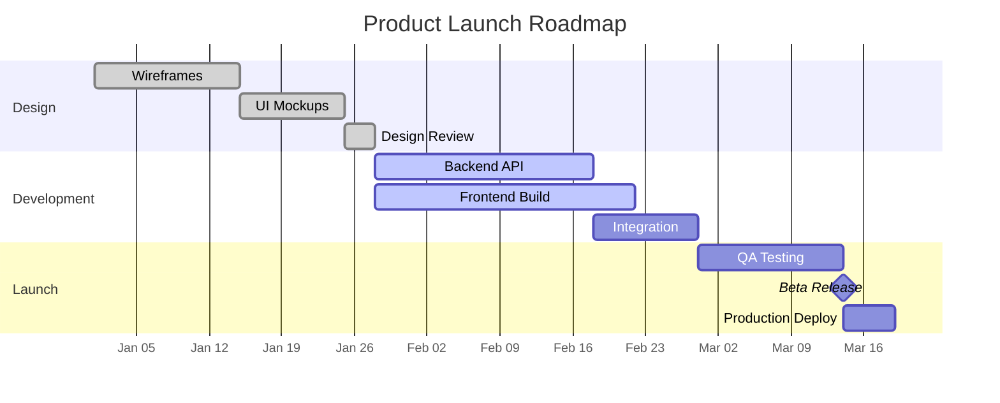
```mermaid
gantt
    title Product Launch Roadmap
    dateFormat YYYY-MM-DD
    axisFormat %b %d

    section Design
        Wireframes           :done,    des1, 2025-01-01, 14d
        UI Mockups           :done,    des2, after des1, 10d
        Design Review        :done,    des3, after des2, 3d

    section Development
        Backend API          :active,  dev1, after des3, 21d
        Frontend Build       :active,  dev2, after des3, 25d
        Integration          :         dev3, after dev1, 10d

    section Launch
        QA Testing           :         qa1, after dev3, 14d
        Beta Release         :milestone, after qa1, 0d
        Production Deploy    :         dep1, after qa1, 5d
```

---

## 8. Pie Chart

Show proportional data at a glance.

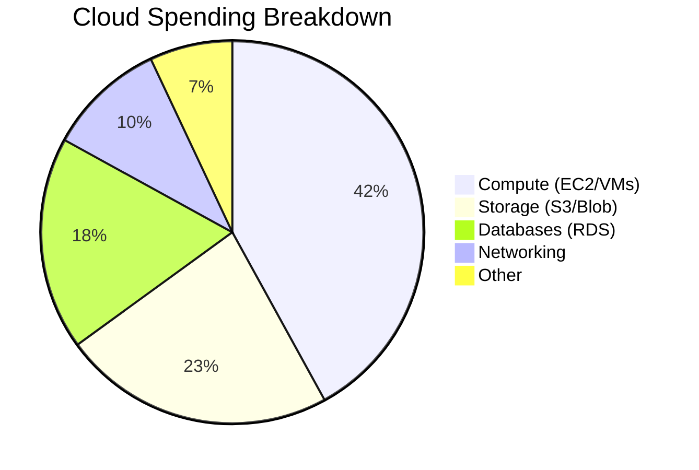
```mermaid
pie title Cloud Spending Breakdown
    "Compute (EC2/VMs)" : 42
    "Storage (S3/Blob)" : 23
    "Databases (RDS)" : 18
    "Networking" : 10
    "Other" : 7
```

---

## 9. Quadrant Chart

Plot items across two dimensions to prioritize work.

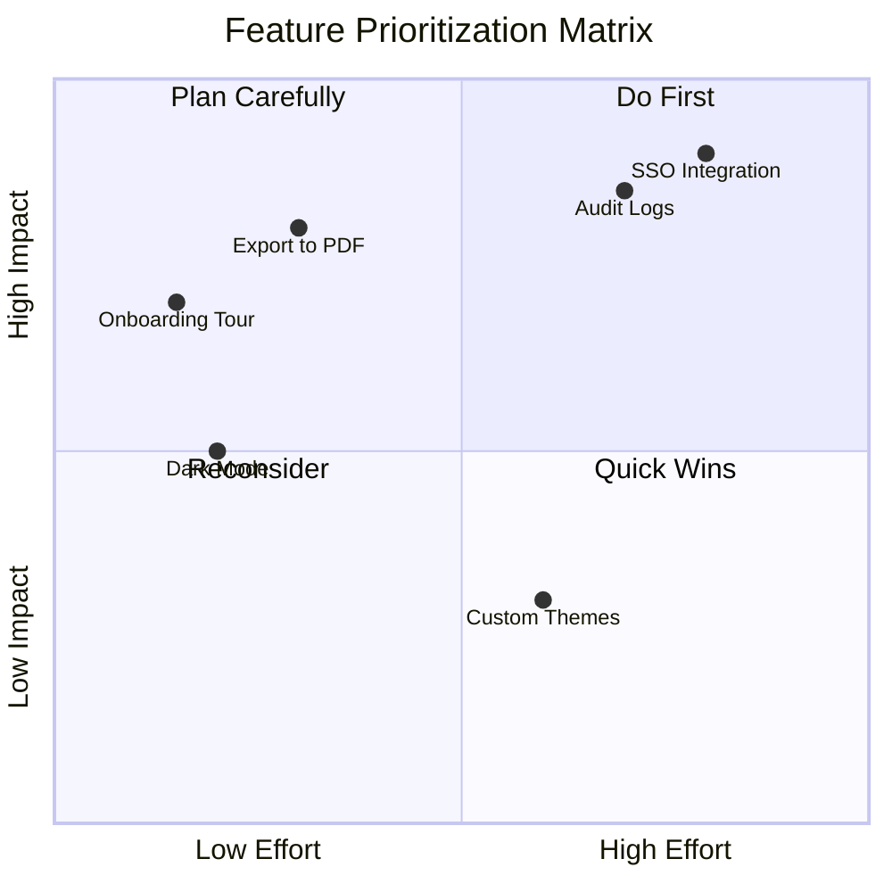
```mermaid
quadrantChart
    title Feature Prioritization Matrix
    x-axis Low Effort --> High Effort
    y-axis Low Impact --> High Impact

    quadrant-1 Do First
    quadrant-2 Plan Carefully
    quadrant-3 Reconsider
    quadrant-4 Quick Wins

    SSO Integration: [0.8, 0.9]
    Dark Mode: [0.2, 0.5]
    Export to PDF: [0.3, 0.8]
    Custom Themes: [0.6, 0.3]
    Onboarding Tour: [0.15, 0.7]
    Audit Logs: [0.7, 0.85]
```

---

## 10. Git Graph

Visualize branching, merging, and release strategies.

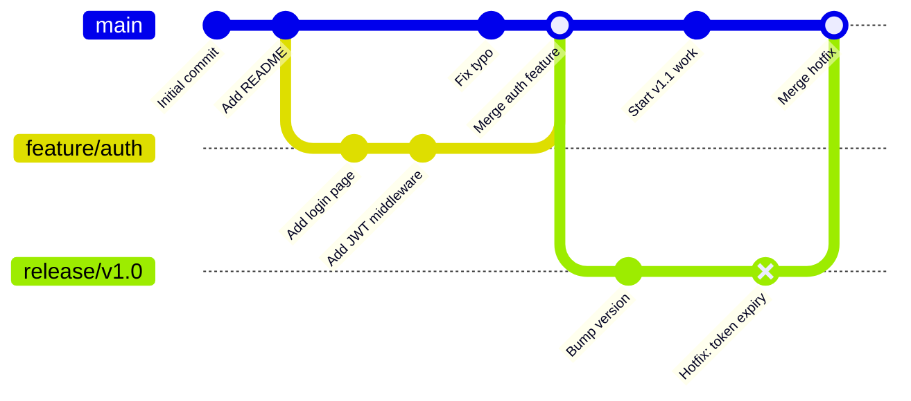
```mermaid
gitGraph
    commit id: "Initial commit"
    commit id: "Add README"
    branch feature/auth
    commit id: "Add login page"
    commit id: "Add JWT middleware"
    checkout main
    commit id: "Fix typo"
    merge feature/auth id: "Merge auth feature"
    branch release/v1.0
    commit id: "Bump version"
    checkout main
    commit id: "Start v1.1 work"
    checkout release/v1.0
    commit id: "Hotfix: token expiry" type: REVERSE
    checkout main
    merge release/v1.0 id: "Merge hotfix"
```

---

## 11. User Journey

Map user experience through a product flow.

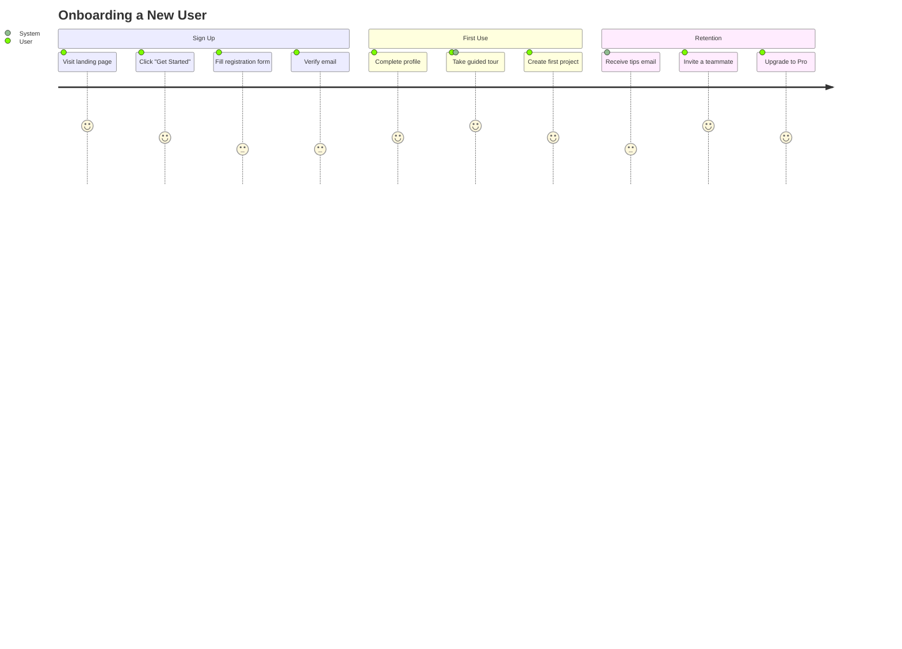
```mermaid
journey
    title Onboarding a New User
    section Sign Up
        Visit landing page     : 5 : User
        Click "Get Started"    : 4 : User
        Fill registration form : 3 : User
        Verify email           : 3 : User
    section First Use
        Complete profile       : 4 : User
        Take guided tour       : 5 : User, System
        Create first project   : 4 : User
    section Retention
        Receive tips email     : 3 : System
        Invite a teammate      : 5 : User
        Upgrade to Pro         : 4 : User
```

---

## 12. Mindmap

Brainstorm and organize ideas hierarchically.

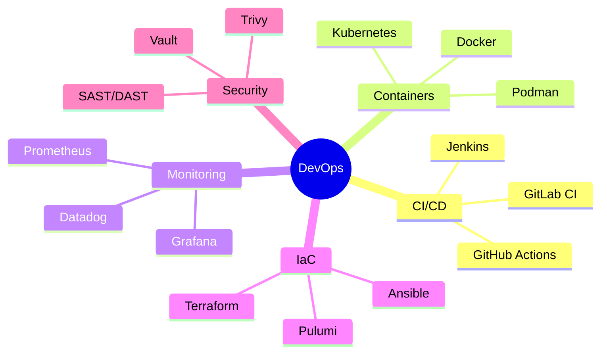
```mermaid
mindmap
    root((DevOps))
        CI/CD
            GitHub Actions
            Jenkins
            GitLab CI
        Containers
            Docker
            Podman
            Kubernetes
        Monitoring
            Prometheus
            Grafana
            Datadog
        IaC
            Terraform
            Ansible
            Pulumi
        Security
            Vault
            Trivy
            SAST/DAST
```

---

## 13. Timeline

Show events in chronological order.

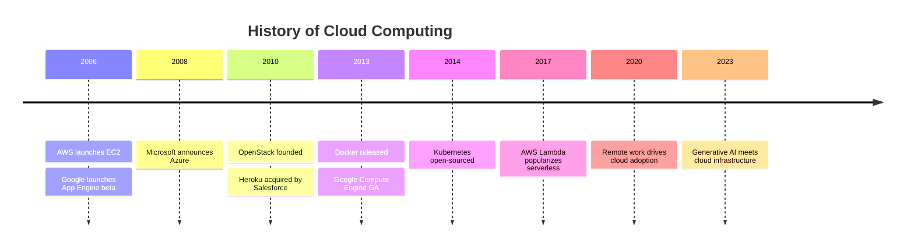
```mermaid
timeline
    title History of Cloud Computing
    2006 : AWS launches EC2
         : Google launches App Engine beta
    2008 : Microsoft announces Azure
    2010 : OpenStack founded
         : Heroku acquired by Salesforce
    2013 : Docker released
         : Google Compute Engine GA
    2014 : Kubernetes open-sourced
    2017 : AWS Lambda popularizes serverless
    2020 : Remote work drives cloud adoption
    2023 : Generative AI meets cloud infrastructure
```

---

## 14. Sankey Diagram

Show flow volume between categories.

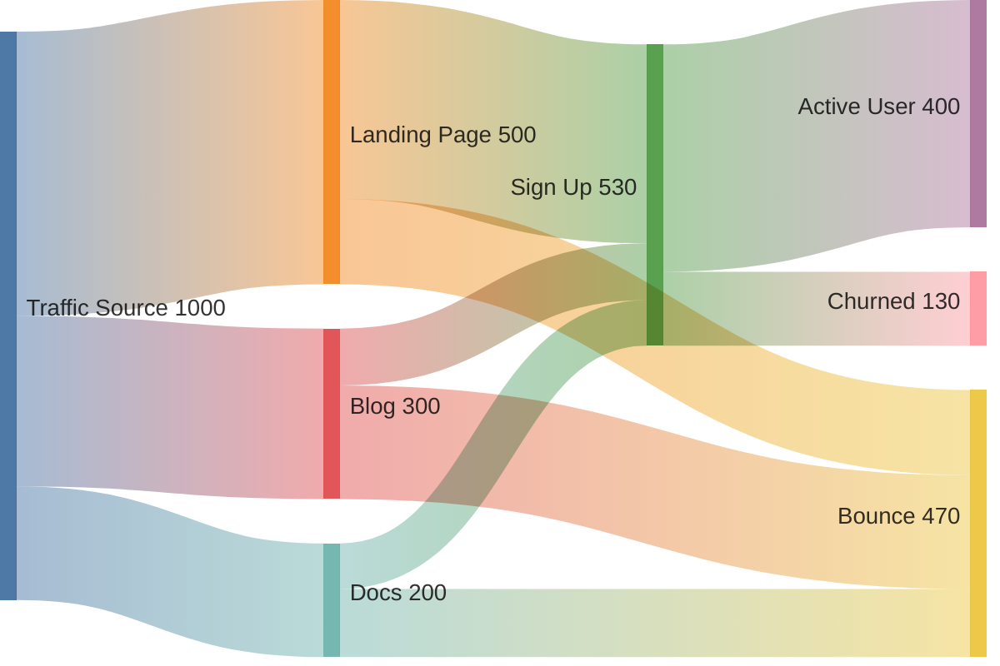
```mermaid
sankey-beta
    Traffic Source,Landing Page,500
    Traffic Source,Blog,300
    Traffic Source,Docs,200
    Landing Page,Sign Up,350
    Landing Page,Bounce,150
    Blog,Sign Up,100
    Blog,Bounce,200
    Docs,Sign Up,80
    Docs,Bounce,120
    Sign Up,Active User,400
    Sign Up,Churned,130
```

---

## 15. XY Chart (Bar)

Display data with labeled axes — great for comparisons.

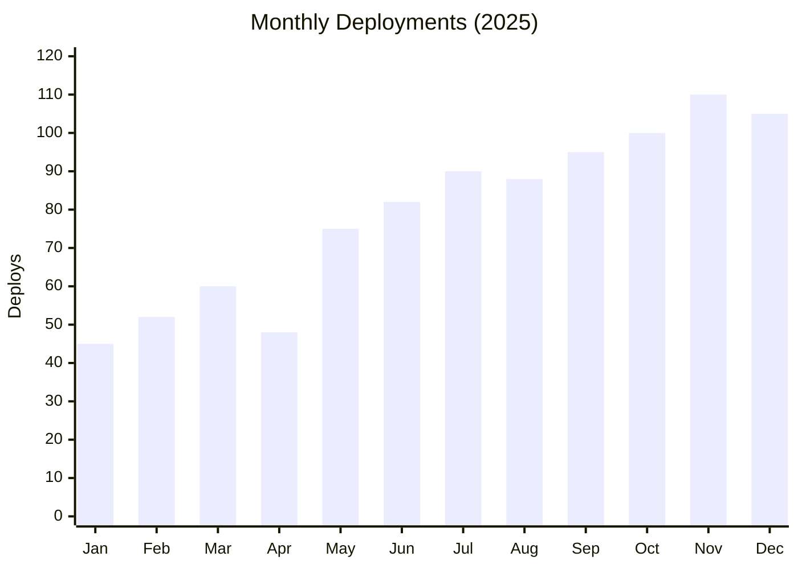
```mermaid
xychart-beta
    title "Monthly Deployments (2025)"
    x-axis [Jan, Feb, Mar, Apr, May, Jun, Jul, Aug, Sep, Oct, Nov, Dec]
    y-axis "Deploys" 0 --> 120
    bar [45, 52, 60, 48, 75, 82, 90, 88, 95, 100, 110, 105]
```

---

## 16. XY Chart (Line)

Trend data over a continuous axis.

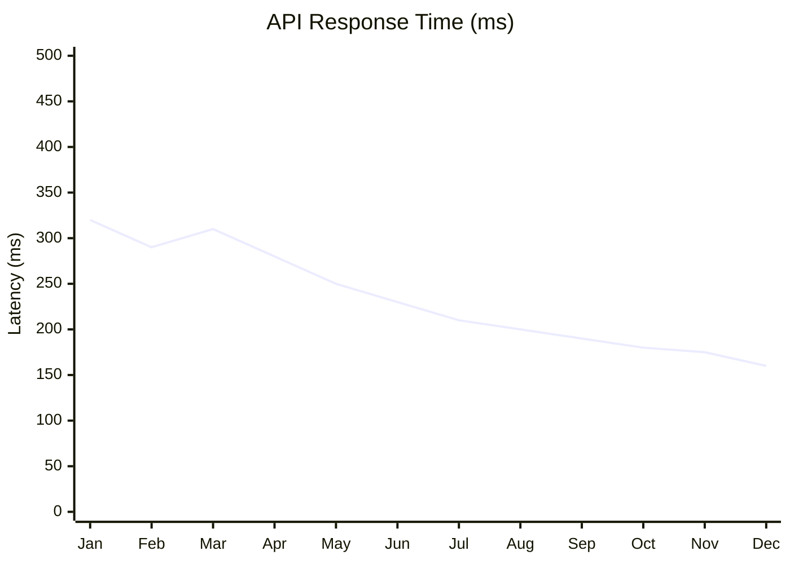
```mermaid
xychart-beta
    title "API Response Time (ms)"
    x-axis [Jan, Feb, Mar, Apr, May, Jun, Jul, Aug, Sep, Oct, Nov, Dec]
    y-axis "Latency (ms)" 0 --> 500
    line [320, 290, 310, 280, 250, 230, 210, 200, 190, 180, 175, 160]
```

---

## 17. Block Diagram

Lay out system architecture with nested blocks and connections.

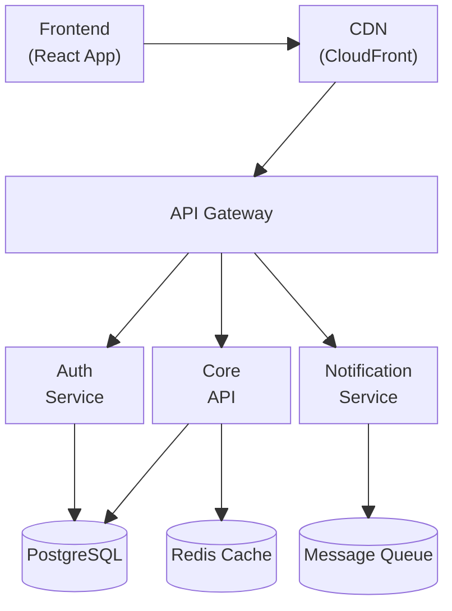
```mermaid
block-beta
    columns 3

    Frontend["Frontend\n(React App)"]:1
    space:1
    CDN["CDN\n(CloudFront)"]:1

    space:3

    APIGateway["API Gateway"]:3

    space:3

    AuthService["Auth\nService"]:1
    CoreAPI["Core\nAPI"]:1
    NotifService["Notification\nService"]:1

    space:3

    DB[("PostgreSQL")]:1
    Cache[("Redis Cache")]:1
    Queue[("Message Queue")]:1

    Frontend --> CDN
    CDN --> APIGateway
    APIGateway --> AuthService
    APIGateway --> CoreAPI
    APIGateway --> NotifService
    AuthService --> DB
    CoreAPI --> DB
    CoreAPI --> Cache
    NotifService --> Queue
```

---

## 18. Requirement Diagram

Trace requirements to design elements and verification.

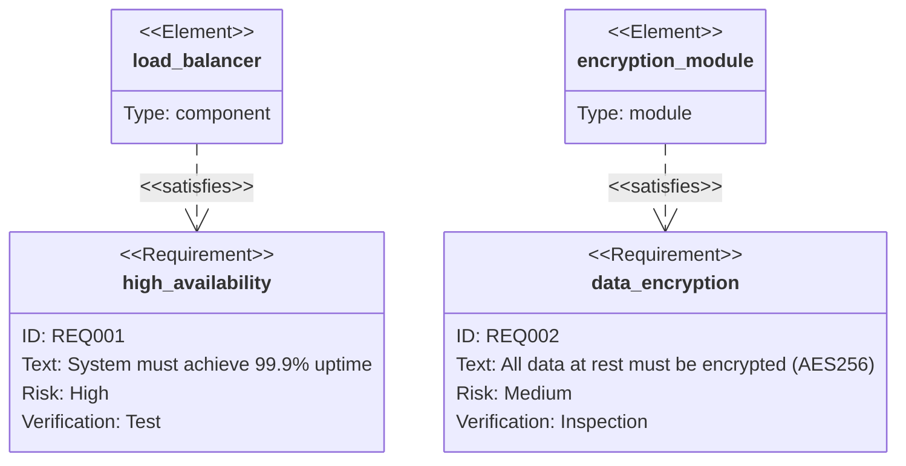
```mermaid
requirementDiagram
    requirement high_availability {
        id: REQ001
        text: System must achieve 99.9% uptime
        risk: high
        verifymethod: test
    }
    requirement data_encryption {
        id: REQ002
        text: All data at rest must be encrypted (AES256)
        risk: medium
        verifymethod: inspection
    }

    element load_balancer {
        type: component
    }
    element encryption_module {
        type: module
    }

    load_balancer - satisfies -> high_availability
    encryption_module - satisfies -> data_encryption
```

---

## 19. C4 Context Diagram

High-level system context using the C4 model.

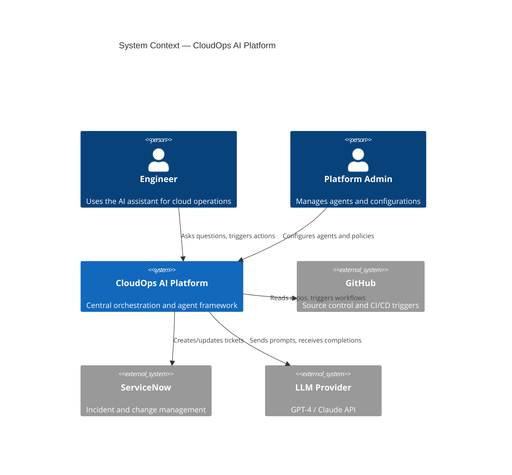
```mermaid
C4Context
    title System Context — CloudOps AI Platform

    Person(user, "Engineer", "Uses the AI assistant for cloud operations")
    Person(admin, "Platform Admin", "Manages agents and configurations")

    System(platform, "CloudOps AI Platform", "Central orchestration and agent framework")

    System_Ext(github, "GitHub", "Source control and CI/CD triggers")
    System_Ext(servicenow, "ServiceNow", "Incident and change management")
    System_Ext(llm, "LLM Provider", "GPT-4 / Claude API")

    Rel(user, platform, "Asks questions, triggers actions")
    Rel(admin, platform, "Configures agents and policies")
    Rel(platform, github, "Reads repos, triggers workflows")
    Rel(platform, servicenow, "Creates/updates tickets")
    Rel(platform, llm, "Sends prompts, receives completions")
```

---

## 20. Packet Diagram

Visualize network packet structure and protocol headers.

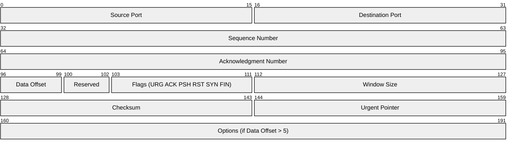
```mermaid
packet-beta
    0-15: "Source Port"
    16-31: "Destination Port"
    32-63: "Sequence Number"
    64-95: "Acknowledgment Number"
    96-99: "Data Offset"
    100-102: "Reserved"
    103-111: "Flags (URG ACK PSH RST SYN FIN)"
    112-127: "Window Size"
    128-143: "Checksum"
    144-159: "Urgent Pointer"
    160-191: "Options (if Data Offset > 5)"
```

---

## 21. Kanban Board

Visualize work-in-progress across stages.

```mermaid
kanban
    column1["Backlog"]
        task1["Research caching strategies"]
        task2["Design error handling RFC"]

    column2["In Progress"]
        task3["Implement auth middleware"]
        task4["Write migration scripts"]

    column3["Review"]
        task5["PR #142 — Rate limiter"]

    column4["Done"]
        task6["Set up CI pipeline"]
        task7["Deploy staging env"]
```

---

## 22. Architecture Diagram

Show cloud or system architecture with groups and services.

```mermaid
architecture-beta
    group cloud(cloud)[Cloud Platform]

    service gateway(internet)[API Gateway] in cloud
    service app(server)[App Server] in cloud
    service db(database)[Database] in cloud
    service cache(database)[Cache] in cloud
    service storage(disk)[Object Storage] in cloud

    gateway:R --> L:app
    app:R --> L:db
    app:R --> L:cache
    app:B --> T:storage
```

---

## Quick Reference

| # | Diagram | Best For |
|---|---------|----------|
| 1-2 | **Flowchart** | Decision logic, process flows |
| 3 | **Sequence** | API calls, component interaction over time |
| 4 | **Class** | OOP structures, data models |
| 5 | **State** | Entity lifecycles, status machines |
| 6 | **ER Diagram** | Database schema design |
| 7 | **Gantt** | Project timelines, task scheduling |
| 8 | **Pie** | Proportional breakdowns |
| 9 | **Quadrant** | Prioritization matrices |
| 10 | **Git Graph** | Branch/merge strategies |
| 11 | **User Journey** | UX flow mapping |
| 12 | **Mindmap** | Brainstorming, topic organization |
| 13 | **Timeline** | Chronological events |
| 14 | **Sankey** | Flow volumes between categories |
| 15-16 | **XY Chart** | Bar and line charts with data |
| 17 | **Block** | System architecture layouts |
| 18 | **Requirement** | Requirements traceability |
| 19 | **C4 Context** | High-level system context (C4 model) |
| 20 | **Packet** | Network protocol structure |
| 21 | **Kanban** | Work-in-progress boards |
| 22 | **Architecture** | Cloud/infra architecture |
