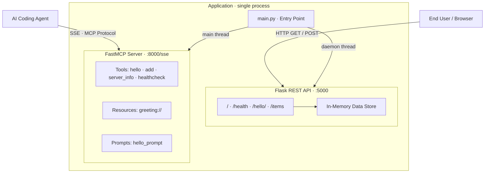
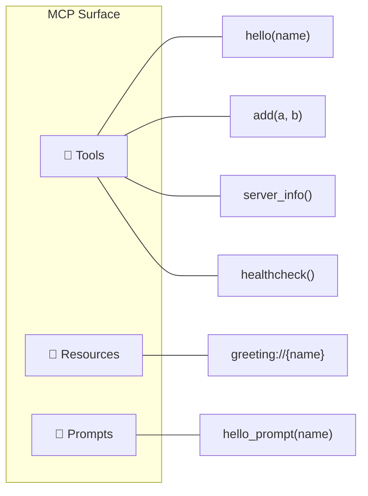
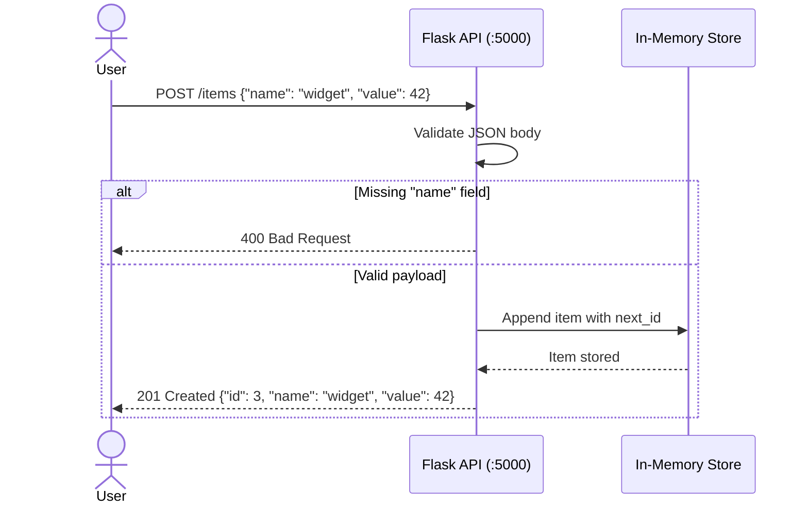

# Architecture — System Design Guide

## High-Level Architecture

---

## Component Responsibilities

### Flask REST API (`app.py`)

The REST API follows the **application factory pattern** via `create_app()`.
This makes testing simple — every test gets a fresh app instance.

| Endpoint        | Method | What it does                        |
|-----------------|--------|-------------------------------------|
| `/`             | GET    | Returns service info + endpoint list|
| `/health`       | GET    | Health check (for load balancers)   |
| `/hello/<name>` | GET    | Personalized greeting               |
| `/items`        | GET    | List all items from in-memory store |
| `/items`        | POST   | Create a new item (JSON body)       |

### FastMCP Server (`mcp_server.py`)

The MCP server exposes **tools**, **resources**, and **prompts** over SSE transport at `http://0.0.0.0:8000/sse`.
AI agents connect to this server to interact with the application programmatically.

### Entry Point (`main.py`)

Orchestrates both servers in a single process:

1. Starts Flask in a **daemon thread** (dies when main process exits)
2. Runs MCP server on the **main thread** (blocking)

This pattern is common for internal microservices that need
both a traditional REST API and an AI-agent interface.

---

## Data Flow — Creating an Item

---

## Design Decisions

| Decision                     | Rationale                                           |
|------------------------------|-----------------------------------------------------|
| In-memory store (not a DB)   | Keeps the boilerplate simple — swap in a DB later   |
| App factory pattern          | Clean test isolation; each test gets a fresh state   |
| Daemon thread for Flask      | Process exits cleanly when MCP server stops          |
| SSE transport for MCP        | Works through firewalls; no WebSocket upgrade needed |
| `uv` for package management  | 10-50x faster than pip; deterministic lockfile       |

---

## Extending the Architecture

When adding a real database, caching layer, or external API integration,
update this document and the mermaid diagrams above so the agent
(and your teammates) always have an accurate mental model of the system.
