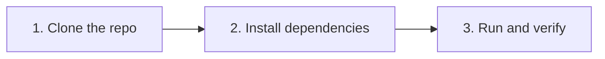
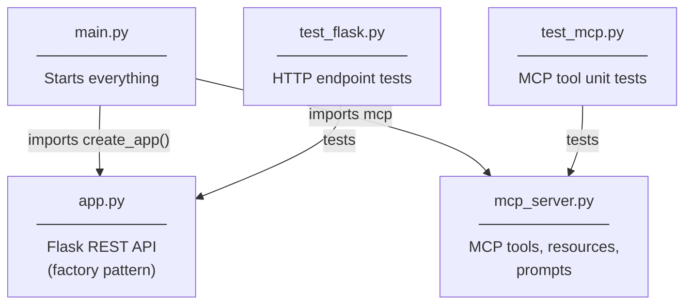
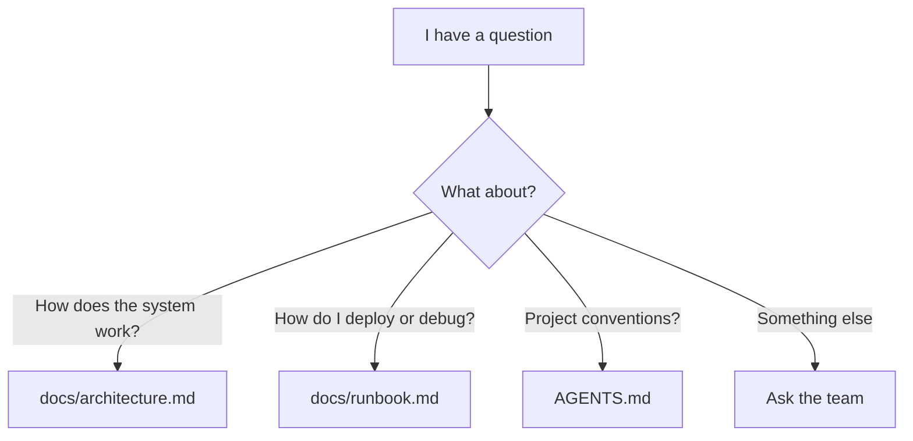

# Onboarding — New Team Member Guide

## Before You Start

You'll need these installed on your Mac or Linux machine:

| Tool       | Why                                   | Install                        |
|------------|---------------------------------------|--------------------------------|
| Python 3.12| Runtime for the application           | `brew install python@3.12`     |
| uv         | Fast Python package manager           | `brew install uv`              |
| Git        | Version control                       | Usually pre-installed          |
| curl       | Testing HTTP endpoints                | Usually pre-installed          |

---

## Setup in 3 Steps



### Step 1 — Clone

```bash
git clone <repo-url>
cd ai_demo
```

### Step 2 — Install dependencies

```bash
uv sync --group dev
```

This installs both production and development dependencies (pytest, httpx, etc.).

### Step 3 — Run and verify

```bash
# Start the servers
uv run python main.py

# In another terminal, run the tests
uv run pytest -v
```

You should see all tests passing. The Flask API is at `http://localhost:5000`
and the MCP server is at `http://localhost:8000/sse`.

---

## Understanding the Codebase

### How the pieces connect



### Key patterns to know

**Application Factory** — Flask uses `create_app()` so each test gets a clean,
isolated app instance. You'll see this pattern in most production Flask projects.

**MCP Decorators** — Tools, resources, and prompts in `mcp_server.py` use
decorators (`@mcp.tool()`, `@mcp.resource()`, `@mcp.prompt()`) that register
them with the MCP server automatically.

**Daemon Thread** — `main.py` runs Flask in a background thread so the process
exits cleanly when you press Ctrl+C. The MCP server runs on the main thread.

---

## Your First Change — A Walkthrough

Let's add a new endpoint as a learning exercise.

### Goal: Add `GET /ping` that returns `{"pong": true}`

**1. Add the route** in `app.py`, inside `create_app()`:

```python
@app.route("/ping")
def ping():
    return jsonify({"pong": True})
```

**2. Add a test** in `tests/test_flask.py`:

```python
def test_ping(client):
    response = client.get("/ping")
    assert response.status_code == 200
    assert response.get_json()["pong"] is True
```

**3. Run tests** to verify:

```bash
uv run pytest -v
```

That's it. This is the same workflow for any new feature.

---

## Where to Find Answers



| Question                         | Where to look               |
|----------------------------------|-----------------------------|
| How is the project structured?   | `AGENTS.md`                 |
| How do the components connect?   | `docs/architecture.md`      |
| How do I deploy or fix issues?   | `docs/runbook.md`           |
| How do I set up my environment?  | This file (`docs/onboarding.md`) |

---

## Tips for Success

- **Run tests often.** `uv run pytest -v` after every change.
- **Read AGENTS.md first.** It's the quickest way to understand project conventions.
- **Use the docs/ folder.** These aren't just for humans — AI agents use them too.
  When you improve a doc, you're also making the AI agent smarter about this project.
